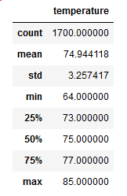

# surfs_up!
Ohau weather analysis using Jupyter Notebook, SQLite & Flask.

## Overview
An avid entrepeneur has approached "the Team" requesting exploratory analysis of opening a Surf n'Shake shop in Oahua. A potential investor to the client, a local 
surfing guru, has expressed concerns regarding weather trends at the proposed location, namely the average temperature to be expected in the months of June and
December: typical high wave and tourist months. Using collected meterological data from reporting weather stations in Oahua for the years 2010 to 2018, "the Team" 
has prepared statistical temperature analysis for presentation by the client to the prospective investor.

## Results
Figure 1.) Temperature Statistics for the Month of June 2010-2018
Figure 2.) Temperature Statistics for the Month of Decemnber 2010-2018

