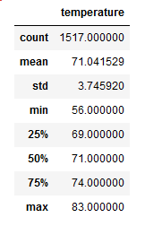

# surfs_up!
Oahu weather analysis using Jupyter Notebook, SQLite & Flask.

## Overview
An avid entrepreneur has approached "the Team" requesting exploratory analysis of opening a Surf n'Shake shop in Oahu. A potential investor to the client, a local 
surfing guru, has expressed concerns regarding weather trends at the proposed location, namely the average temperature to be expected in the months of June and
December: typical high wave and tourist months. Using collected meteorological data from reporting weather stations in Oahu for the years 2010 to 2018, "the Team" 
has prepared statistical temperature analysis for presentation by the client to the prospective investor.

## Results
Figure 1.) Temperature Statistics for the Month of June 2010-2018

Figure 2.) Temperature Statistics for the Month of December 2010-2018

* The month of June shows a slight higher average temperature of 3 degrees over December.
* The maximum recorded temperature for June is only 2 degrees higher than records from December.
* However, the minimum recorded temperature for December is a noticeable 8 degrees.

## Summary
When comparing the datasets statistically for the months June and December at the Oahu location, the variances between average, maximum and minimum temperature
show very little variance at all; at least not enough to keep customers from ordering shakes and surfing. Two additional queries that could be performed to "seal the 
deal" for the investor would be humidity statistics and average wind speed.
